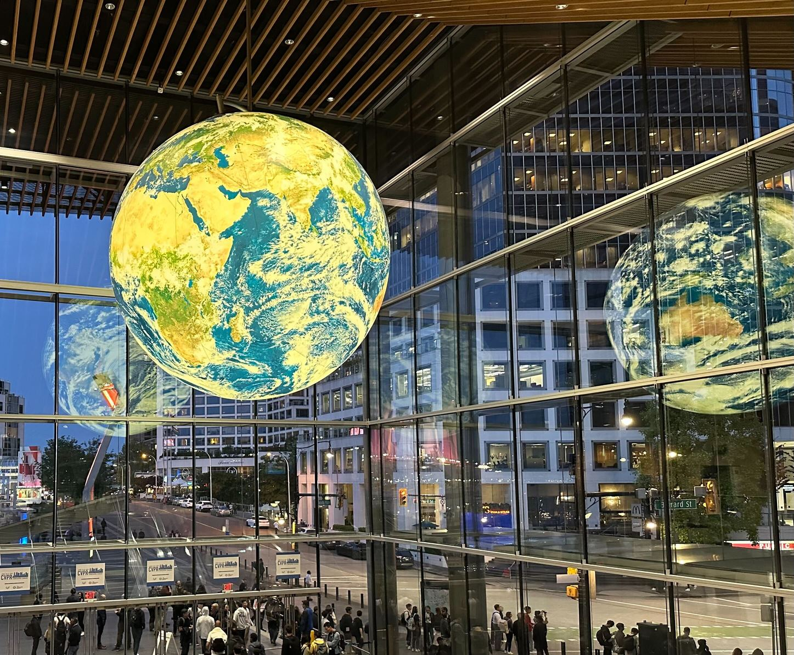
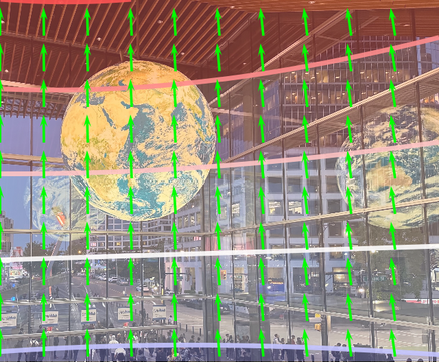
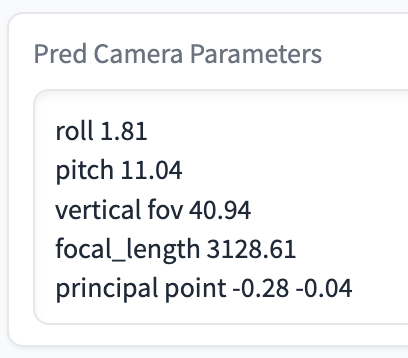
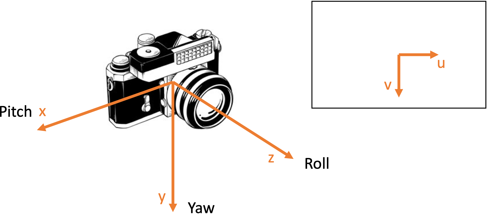

<!-- omit in toc -->
Perspective Fields for Single Image Camera Calibration
================================================================
[](https://huggingface.co/spaces/jinlinyi/PerspectiveFields)

###  [Project Page](https://jinlinyi.github.io/PerspectiveFields/)  | [Paper](https://arxiv.org/abs/2212.03239) | [Live Demo 🤗](https://huggingface.co/spaces/jinlinyi/PerspectiveFields)

CVPR 2023 (✨Highlight)
<h4>

[Linyi Jin](https://jinlinyi.github.io/)<sup>1</sup>, [Jianming Zhang](https://jimmie33.github.io/)<sup>2</sup>, [Yannick Hold-Geoffroy](https://yannickhold.com/)<sup>2</sup>, [Oliver Wang](http://www.oliverwang.info/)<sup>2</sup>, [Kevin Matzen](http://kmatzen.com/)<sup>2</sup>, [Matthew Sticha](https://www.linkedin.com/in/matthew-sticha-746325202/)<sup>1</sup>, [David Fouhey](https://web.eecs.umich.edu/~fouhey/)<sup>1</sup>

<span style="font-size: 14pt; color: #555555">
 <sup>1</sup>University of Michigan, <sup>2</sup>Adobe Research
</span>
</h4>
<hr>

<p align="center">


</p>
We propose Perspective Fields as a representation that models the local perspective properties of an image. Perspective Fields contain per-pixel information about the camera view, parameterized as an up vector and a latitude value. 

<p align="center">
   
</p>

📷 From Perspective Fields, you can also get camera parameters if you assume certain camera models. We provide models to recover camera roll, pitch, fov and principal point location.

<p align="center">
  
  
  
</p>

<!-- omit in toc -->
Updates
------------------
- We released a new model trained on [360cities](https://www.360cities.net/) and [EDINA](https://github.com/tien-d/EgoDepthNormal/blob/main/README_dataset.md) dataset, consisting of indoor🏠, outdoor🏙️, natural🌳, and egocentric👋 data!
- Live demo released 🤗. https://huggingface.co/spaces/jinlinyi/PerspectiveFields. Thanks Huggingface for funding this demo!

<!-- omit in toc -->
Table of Contents
------------------
- [Environment Setup](#environment-setup)
- [Model Zoo](#model-zoo)
- [Coordinate Frame](#coordinate-frame)
- [Inference](#inference)
- [Camera Parameters to Perspective Fields](#camera-parameters-to-perspective-fields)
- [Visualize Perspective Fields](#visualize-perspective-fields)
- [Training](#training)
    - [Datasets](#datasets)
    - [Training PerspectiveNet + ParamNet](#training-perspectivenet--paramnet)
- [Testing](#testing)
    - [Datasets](#datasets-1)
    - [Testing PerspectiveNet + ParamNet](#testing-perspectivenet--paramnet)
- [Citation](#citation)
- [Acknowledgment](#acknowledgment)


[1]: ./docs/environment.md
[2]: ./jupyter-notebooks/camera2perspective.ipynb
[3]: ./jupyter-notebooks/predict_perspective_fields.ipynb
[4]: ./jupyter-notebooks/perspective_paramnet.ipynb
[5]: ./docs/train.md
[6]: ./docs/test.md
[7]: ./docs/models.md


## Environment Setup
PerspectiveFields requires python >= 3.8 and [PyTorch](https://pytorch.org/).


| ***Pro tip:*** *use [mamba](https://github.com/mamba-org/mamba) in place of conda for much faster installs.*
The dependencies can be installed by running:
```bash
git clone git@github.com:jinlinyi/PerspectiveFields.git
# create virtual env
conda create -n perspective python=3.9
conda activate perspective
# install pytorch compatible to your system https://pytorch.org/get-started/previous-versions/
# conda install pytorch torchvision cudatoolkit -c pytorch
conda install pytorch=1.10.0 torchvision torchaudio cudatoolkit=11.3 -c pytorch
# conda packages
conda install -c conda-forge openexr-python openexr
# pip packages
pip install -r requirements.txt
# install mmcv with mim, I encountered some issue with pip install mmcv :(
mim install mmcv
# install Perspective Fields.
pip install -e .
```


## Model Zoo

NOTE: Extract model weights under `perspectiveField/models`.

| Model Name and Weights                                                                                                    | Training Dataset                                                                                                          | Config File                                  | Outputs                                                           | Expected input                                                                                     |
| ------------------------------------------------------------------------------------------------------------------------- | ------------------------------------------------------------------------------------------------------------------------- | -------------------------------------------- | ----------------------------------------------------------------- | -------------------------------------------------------------------------------------------- |
| [NEW][Paramnet-360Cities-edina-centered](https://www.dropbox.com/s/z2dja70bgy007su/paramnet_360cities_edina_rpf.pth)       | [360cities](https://www.360cities.net/) and [EDINA](https://github.com/tien-d/EgoDepthNormal/blob/main/README_dataset.md) | [paramnet_360cities_edina_rpf.yaml](models/paramnet_360cities_edina_rpf.yaml) | Perspective Field + camera parameters (roll, pitch, vfov)         | Uncropped, indoor🏠, outdoor🏙️, natural🌳, and egocentric👋 data                              |
| [NEW][Paramnet-360Cities-edina-uncentered](https://www.dropbox.com/s/nt29e1pi83mm1va/paramnet_360cities_edina_rpfpp.pth)  | [360cities](https://www.360cities.net/) and [EDINA](https://github.com/tien-d/EgoDepthNormal/blob/main/README_dataset.md) | [paramnet_360cities_edina_rpfpp.yaml](models/paramnet_360cities_edina_rpfpp.yaml) | Perspective Field + camera parameters (roll, pitch, vfov, cx, cy) | Cropped, indoor🏠, outdoor🏙️, natural🌳, and egocentric👋 data                                |
| [PersNet-360Cities](https://www.dropbox.com/s/czqrepqe7x70b7y/cvpr2023.pth)                                               | [360cities](https://www.360cities.net)                                                                                    | [cvpr2023.yaml](models/cvpr2023.yaml)              | Perspective Field                                                 | Indoor🏠, outdoor🏙️, and natural🌳 data.                                                     |
| [PersNet_paramnet-GSV-centered](https://www.dropbox.com/s/g6xwbgnkggapyeu/paramnet_gsv_rpf.pth)                           | [GSV](https://research.google/pubs/pub36899/)                                                                             | [paramnet_gsv_rpf.yaml](models/paramnet_gsv_rpf.yaml)      | Perspective Field + camera parameters (roll, pitch, vfov)         | Uncropped, street view🏙️ data.                                                              |
| [PersNet_Paramnet-GSV-uncentered](https://www.dropbox.com/s/ufdadxigewakzlz/paramnet_gsv_rpfpp.pth)                       | [GSV](https://research.google/pubs/pub36899/)                                                                             | [paramnet_gsv_rpfpp.yaml](models/paramnet_gsv_rpfpp.yaml)    | Perspective Field + camera parameters (roll, pitch, vfov, cx, cy) | Cropped, street view🏙️ data.                                                               |

## Coordinate Frame

<p align="center">



`yaw / azimuth`: camera rotation about the y-axis
`pitch / elevation`: camera rotation about the x-axis
`roll`: camera rotation about the z-axis

Extrinsics: `rotz(roll).dot(rotx(elevation)).dot(roty(azimuth))`

</p>

## Inference
- [Live Demo 🤗](https://huggingface.co/spaces/jinlinyi/PerspectiveFields). 
- We also provide notebook to [Predict Perspective Fields](./jupyter-notebooks/predict_perspective_fields.ipynb) and [Recover Camera Parameters](./jupyter-notebooks/perspective_paramnet.ipynb). 
- Alternatively, you can also run `demo.py`:
```bash
python demo/demo.py \
--config-file <config-path> \ #../jupyter-notebooks/models/cvpr2023.yaml 
--input <input-path> \ #../assets/imgs 
--output <output-path> \ #debug 
--opts MODEL.WEIGHTS <ckpt-path> #../jupyter-notebooks/models/cvpr2023.pth
```

## Camera Parameters to Perspective Fields
Checkout [Jupyter Notebook](./jupyter-notebooks/camera2perspective.ipynb). 
Perspective Fields can be calculated from camera parameters. If you prefer, you can also manually calculate the corresponding Up-vector and Latitude map by following Equations 1 and 2 in our paper.
Our code currently supports:
1) [Pinhole model](https://hedivision.github.io/Pinhole.html) [Hartley and Zisserman 2004] (Perspective Projection) 
```python
from perspective2d.utils.panocam import PanoCam
# define parameters
roll = 0
pitch = 20
vfov = 70
width = 640
height = 480
# get Up-vectors.
up = PanoCam.get_up(np.radians(vfov), width, height, np.radians(pitch), np.radians(roll))
# get Latitude.
lati = PanoCam.get_lat(np.radians(vfov), width, height, np.radians(pitch), np.radians(roll))
```
2) [Unified Spherical Model](https://drive.google.com/file/d/1pZgR3wNS6Mvb87W0ixOHmEVV6tcI8d50/view) [Barreto 2006; Mei and Rives 2007] (Distortion). 
```python
xi = 0.5 # distortion parameter from Unified Spherical Model

x = -np.sin(np.radians(vfov/2))
z = np.sqrt(1 - x**2)
f_px_effective = -0.5*(width/2)*(xi+z)/x
crop, _, _, _, up, lat, xy_map = PanoCam.crop_distortion(equi_img,
                                             f=f_px_effective,
                                             xi=xi,
                                             H=height,
                                             W=width,
                                             az=yaw, # degrees
                                             el=-pitch,
                                             roll=-roll)
```

## Visualize Perspective Fields
We provide a one-line code to blend Perspective Fields onto input image.
```python
import matplotlib.pyplot as plt
from perspective2d.utils import draw_perspective_fields
# Draw up and lati on img. lati is in radians.
blend = draw_perspective_fields(img, up, lati)
# visualize with matplotlib
plt.imshow(blend)
plt.show()
```
Perspective Fields can serve as an easy visual check for correctness of the camera parameters.

- For example, we can visualize the Perspective Fields based on calibration results from this awesome [repo](https://github.com/dompm/spherical-distortion-dataset).


<p align="center">


- Left: We plot the perspective fields based on the numbers printed on the image, they look accurate😊;

- Mid: If we try a number that is 10% off (0.72*0.9=0.648), we see mismatch in Up directions at the top right corner;

- Right: If distortion is 20% off (0.72*0.8=0.576), the mismatch becomes more obvious.
</p>

## Training

<details>
<summary>[Click to expand]</summary>

#### Datasets

We used Google street view dataset to train the ParamNet in our paper Table 3, 4.
Download GSV datasets:
```bash
wget https://www.dropbox.com/s/plcmcza8vfmmpkm/google_street_view_191210.tar
wget https://www.dropbox.com/s/9se3lrpljd59cod/gsv_test_crop_uniform.tar
```
Extract the dataset under `perspectiveField/datasets`.


Note that we used images from [360cities](https://www.360cities.net) to train the PerspectiveNet in Table 1.


#### Training PerspectiveNet + ParamNet
Download initial weights from segformer.b3.512x512.ade.160k.pth:
```bash
wget https://www.dropbox.com/s/0axxpfga265gq3o/ade_pretrained.pth
```
Place it under `perspectiveField/init_model_weights`.


- We first trained PerspectiveNet:
```bash
python -W ignore train.py \
--config-file configs/config-mix-gsv-regress.yaml \
--num-gpus 2 \
--dist-url tcp://127.0.0.1:$((RANDOM +10000)) \
OUTPUT_DIR "./exp/step01-gsv-perspective-pretrain" \
SOLVER.IMS_PER_BATCH 64
```

- Then we trained the ParamNet, you can download the model from the previous step here:
```bash
wget https://www.dropbox.com/s/c9199n5lmy30tob/gsv_persnet_pretrain.pth
```

- To train the ParamNet to predict roll, pitch and fov:
```bash
python -W ignore train.py \
--config-file configs/config-gsv-rpf.yaml \
--num-gpus 2 \
--dist-url tcp://127.0.0.1:$((RANDOM +10000)) \
OUTPUT_DIR "./exp/step02-gsv-paramnet-rpf"
```

- To train the ParamNet to predict roll, pitch, fov, and principal point:
```bash
python -W ignore train.py \
--config-file configs/config-gsv-rpfpp.yaml \
--num-gpus 2 \
--dist-url tcp://127.0.0.1:$((RANDOM +10000)) \
OUTPUT_DIR "./exp/step02-gsv-paramnet-rpfpp"
```

</details>

## Testing


<details>
<summary>[Click to expand]</summary>

#### Datasets

In our paper, we tested the **PersNet-360Cities** model on images from publicly available datasets [Stanford2D3D](http://buildingparser.stanford.edu/dataset.html) and [TartanAir](http://theairlab.org/tartanair-dataset/). Results can be found in Table 1.

To download Stanford2d3d dataset:
First agree to their data sharing and usage term: [link](https://docs.google.com/forms/d/e/1FAIpQLScFR0U8WEUtb7tgjOhhnl31OrkEs73-Y8bQwPeXgebqVKNMpQ/viewform?c=0&w=1). 
```bash
https://www.dropbox.com/sh/ycd4hv0t1nqagub/AACjqZ2emGw7L-aAJ1rmpX4-a
```

Download TartanAir dataset:
```bash
https://www.dropbox.com/sh/7tev8uqnnjfhzhb/AAD9y_d1DCcoZ-AQDEQ1tn0Ua
```
Extract the datasets under `perspectiveField/datasets`.

We also tested the **PersNet_paramnet-GSV-centered** and **PersNet_Paramnet-GSV-uncentered** models on centered and uncentered images from Google Street View (GSV). Results can be found in Tables 3 and 4.

Download GSV datasets:
```bash
wget https://www.dropbox.com/s/plcmcza8vfmmpkm/google_street_view_191210.tar
wget https://www.dropbox.com/s/9se3lrpljd59cod/gsv_test_crop_uniform.tar
```
Extract the datasets under `perspectiveField/datasets`.


#### Testing PerspectiveNet + ParamNet

- PerspectiveNet:

First, to test PerspectiveNet, provide a dataset name corresponding to a name/path pair from `perspective2d/data/datasets/builtin.py`. Create and provide an output folder under `perspectiveField/exps`. Choose a model and provide the path to the config file and weights, both of which should be under `perspectiveField/models`.

Example:
```bash
python -W ignore demo/test_persfield.py \
--dataset stanford2d3d_test \
--output ./exps/persnet_360_cities_test \
--config-file ./models/cvpr2023.yaml \
--opts MODEL.WEIGHTS ./models/cvpr2023.pth
```

- ParamNet:

To test ParamNet, again provide a dataset name, output folder, and a path to config and model weights, just as with PerspectiveNet.

Example:
```bash
python -W ignore demo/test_param_network.py \
--dataset gsv_test  \
--output ./exps/paramnet_gsv_test \
--config-file ./models/paramnet_gsv_rpf.yaml \
--opts MODEL.WEIGHTS ./models/paramnet_gsv_rpf.pth
```

```bash
python -W ignore demo/test_param_network.py \
--dataset gsv_test_crop_uniform  \
--output ./exps/paramnet_gsv_test \
--config-file ./models/paramnet_gsv_rpfpp.yaml \
--opts MODEL.WEIGHTS ./models/paramnet_gsv_rpfpp.pth
```

</details>

Citation
--------
If you find this code useful, please consider citing:

```text
@inproceedings{jin2023perspective,
      title={Perspective Fields for Single Image Camera Calibration},
      author={Linyi Jin and Jianming Zhang and Yannick Hold-Geoffroy and Oliver Wang and Kevin Matzen and Matthew Sticha and David F. Fouhey},
      booktitle = {CVPR},
      year={2023}
}
```

Acknowledgment
--------------
This work was partially funded by the DARPA Machine Common Sense Program.
We thank authors from [A Deep Perceptual Measure for Lens and Camera Calibration](https://github.com/dompm/spherical-distortion-dataset) for releasing their code on Unified Spherical Model.
