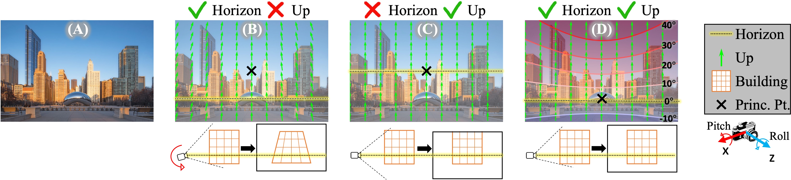
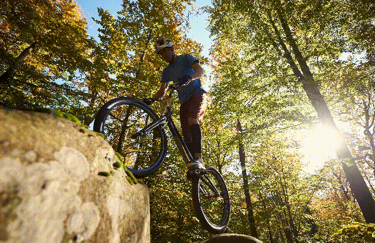
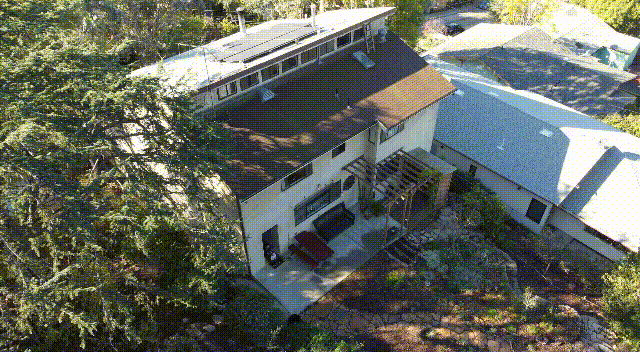

Perspective Fields for Single Image Camera Calibration
================================================================
[](https://huggingface.co/spaces/jinlinyi/PerspectiveFields)

###  [Project Page](https://jinlinyi.github.io/PerspectiveFields/)  | [Paper](https://arxiv.org/abs/2212.03239) | [Live Demo 🤗](https://huggingface.co/spaces/jinlinyi/PerspectiveFields)

CVPR 2023 (✨Highlight)
<h4>

[Linyi Jin](https://jinlinyi.github.io/)<sup>1</sup>, [Jianming Zhang](https://jimmie33.github.io/)<sup>2</sup>, [Yannick Hold-Geoffroy](https://yannickhold.com/)<sup>2</sup>, [Oliver Wang](http://www.oliverwang.info/)<sup>2</sup>, [Kevin Matzen](http://kmatzen.com/)<sup>2</sup>, [Matthew Sticha](https://www.linkedin.com/in/matthew-sticha-746325202/)<sup>1</sup>, [David Fouhey](https://web.eecs.umich.edu/~fouhey/)<sup>1</sup>
<span style="font-size: 14pt; color: #555555">
 <sup>1</sup>University of Michigan, <sup>2</sup>Adobe Research
</span>
</h4>
<hr>


We propose Perspective Fields as a representation that models the local perspective properties of an image. Perspective Fields contain per-pixel information about the camera view, parameterized as an up vector and a latitude value. 

   

📷 From Perspective Fields, you can also get camera parameters if you assume certain camera models. We provide models to recover camera roll, pitch, fov and principal point location.


Updates
------------------
- We released a new model trained on [360cities](https://www.360cities.net/) and [EDINA](https://github.com/tien-d/EgoDepthNormal/blob/main/README_dataset.md) dataset, consisting of indoor🏠, outdoor🏙️, nature🌳, and egocentric👋 data!
- Live demo released 🤗. https://huggingface.co/spaces/jinlinyi/PerspectiveFields. Thanks Huggingface for funding this demo!

Usage Instructions
------------------

1. [Setup your environment][1]
2. [Compute perspective fields based on pin-hole camera parameters][2]
3. [Inference on a single image][3]
4. [Get camera parameters from Perspective Fields][4]
5. [Train PerspectiveNet + ParamNet][5]
6. [Test (TODO)][6]

[1]: ./docs/environment.md
[2]: ./jupyter-notebooks/camera2perspective.ipynb
[3]: ./jupyter-notebooks/predict_perspective_fields.ipynb
[4]: ./jupyter-notebooks/perspective_paramnet.ipynb
[5]: ./docs/train.md
[6]: ./docs/test.md


Citation
--------
If you find this code useful, please consider citing:

```text
@inproceedings{jin2023perspective,
      title={Perspective Fields for Single Image Camera Calibration},
      author={Linyi Jin and Jianming Zhang and Yannick Hold-Geoffroy and Oliver Wang and Kevin Matzen and Matthew Sticha and David F. Fouhey},
      booktitle = {CVPR},
      year={2023}
}
```

Acknowledgment
--------------
This work was partially funded by the DARPA Machine Common Sense Program.
